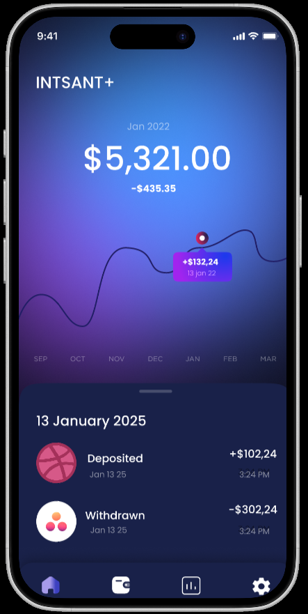
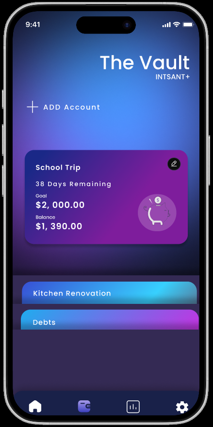
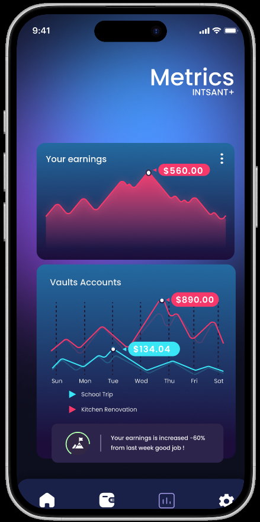

# 📱 Instant+ — A Smarter Way to Save

<div align="center">

**A mobile savings application that helps users build better financial habits through goal-based LockBoxes, recurring deposits, and progress tracking.**

[](https://www.figma.com/design/KXhlbENeWPezT9ehCQGmeb/Instant-?node-id=0-1&t=AFvQODKEjW7AXU6Z-1)

</div>

<br>

<div align="center">
  
</div>

---

## About The Project

Managing savings goals can be difficult when progress is invisible and financial discipline is inconsistent.

**Instant+** addresses this challenge by allowing users to create virtual savings "LockBoxes" with customizable durations, automated recurring deposits, and real-time progress tracking. The application provides visual insights into savings growth while encouraging users to stay committed to their financial goals.

Developed as a mobile application project for CSCI 4100U, Instant+ focuses on creating a simple, engaging, and intuitive savings experience.

---

## Key Features

### 🔒 LockBox Savings System

Create virtual LockBoxes with customizable savings durations:

- 1 Week
- 1 Month
- 1 Year

Funds remain dedicated to a savings goal until the LockBox reaches maturity.

### 💰 Automated Recurring Deposits

- Weekly deposits
- Monthly deposits
- Easy modification and cancellation

### 📈 Savings Analytics

- Goal completion percentage
- Savings growth over time
- Deposit history insights

### 🔔 Smart Notifications

Receive reminders for:

- Upcoming deposits
- Goal milestones
- LockBox maturity dates

### 🎯 Goal Tracking

Set personalized financial goals and monitor progress through intuitive dashboards and visual indicators.

---

## Screenshots

| Home Screen | LockBox Details | Analytics |
|------------|------------|------------|
|  |  |  |

---

## Built With

### Mobile Development

- Java
- Android Studio
- Android SDK
- Material Design

### Backend & Services

- Firebase Authentication
- Firebase Firestore

### APIs

- Currency Exchange API

### Data Visualization

- MPAndroidChart

---

## My Contributions

As part of a five-member development team, I contributed to:

- UI/UX mockup design collaboration
- Core application page setup
- Savings data model development
- Integration between UI components and data models
- General application architecture support

---

## Installation

### Prerequisites

- Android Studio
- Android SDK
- Firebase Project

### Setup

```bash
git clone https://github.com/ranrej/MobileProject_InstantPlus.git
```

Open the project in Android Studio and run the application on an emulator or physical device.

---

## Future Improvements

- Bank account integration
- AI-powered savings recommendations
- Shared family savings goals
- Savings streak rewards system
- Dark mode support
- Cross-platform support

---

## Team & Contributors

<div align="center">

<table>
  <tr>
    <td align="center" width="200">
      <a href="https://github.com/JasonB2004">
        <br>
        <b>Jason Badwal</b>
      </a>
      <br><br>
      Authentication<br>
      Firebase<br>
      Notifications
    </td>

  <td align="center" width="200">
      <a href="https://github.com/Arujan619">
        <br>
        <b>Arujan Srimohan</b>
      </a>
      <br><br>
      Data Models<br>
      Analytics<br>
      Visualizations
    </td>

  <td align="center" width="200">
      <a href="https://github.com/elainey188">
        <br>
        <b>Elaine Nankanja</b>
      </a>
      <br><br>
      User Profiles<br>
      Authentication Features
    </td>
  </tr>

  <tr>
    <td align="center" width="200">
      <a href="https://github.com/ZephyrA1">
        <br>
        <b>Abdul Rahim Mohsin</b>
      </a>
      <br><br>
      UI Design<br>
      Navigation<br>
      Currency API
    </td>

  <td align="center" width="200">
      <a href="https://github.com/ranrej">
        <br>
        <b>Rania Rejdal</b>
      </a>
      <br><br>
      UI Mockups<br>
      Data Models<br>
      UI Integration
    </td>
  </tr>
</table>

</div>

---

## Figma Design

🎨 **Design Prototype:**

[View the Figma Project](https://www.figma.com/design/KXhlbENeWPezT9ehCQGmeb/Instant-?node-id=0-1&t=AFvQODKEjW7AXU6Z-1)

---

## Repository Structure

```text
MobileProject/
├── android/
├── ios/
├── assets/
│   ├── Images/
│   ├── backgrounds/
│   ├── icons/
│   └── temporary/
├── lib/
│   ├── Authentication/
│   ├── Classes/
│   ├── HomePage/
│   ├── LandingPage/
│   ├── MainScreen/
│   ├── MetricsPage/
│   ├── Notifications/
│   ├── OnboardingPages/
│   ├── ProfilePage/
│   ├── ResetPasswordPage/
│   ├── SigninPage/
│   ├── SignupPage/
│   ├── WalletPage/
│   ├── dbHelper.dart
│   ├── firebase_options.dart
│   └── main.dart
├── test/
├── pubspec.yaml
└── firebase.json

---

## License

This project was developed for educational purposes as part of CSCI 4100U.
